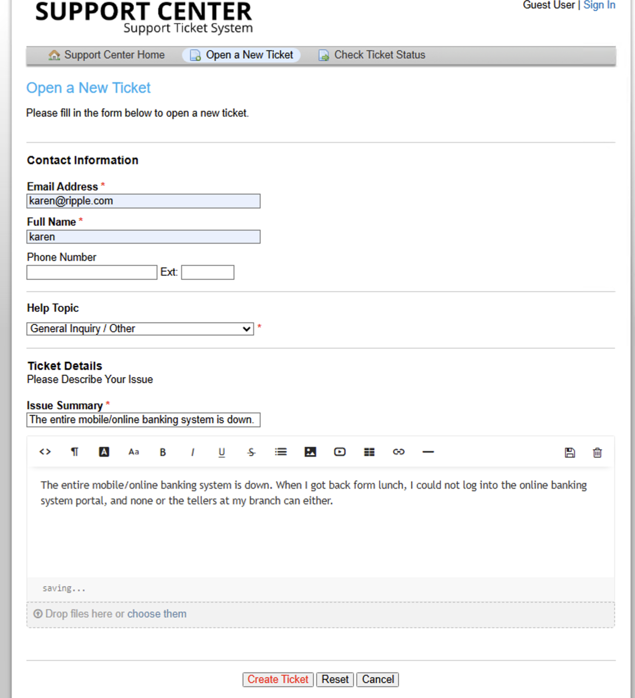
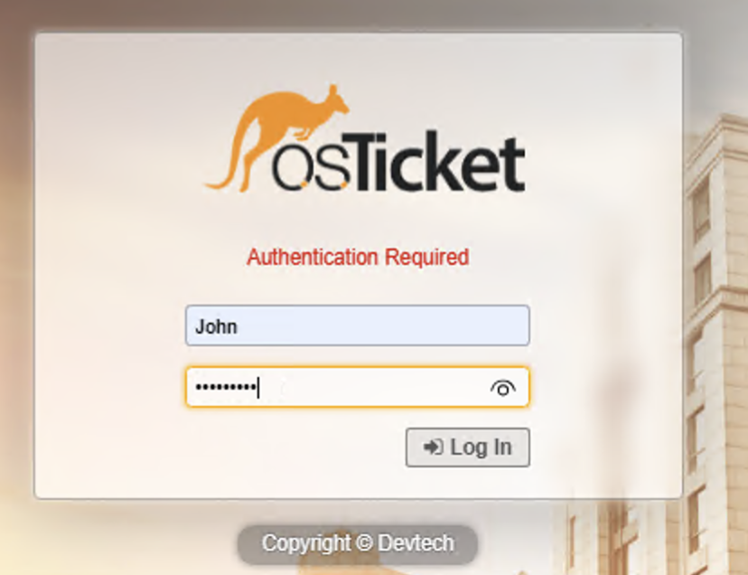
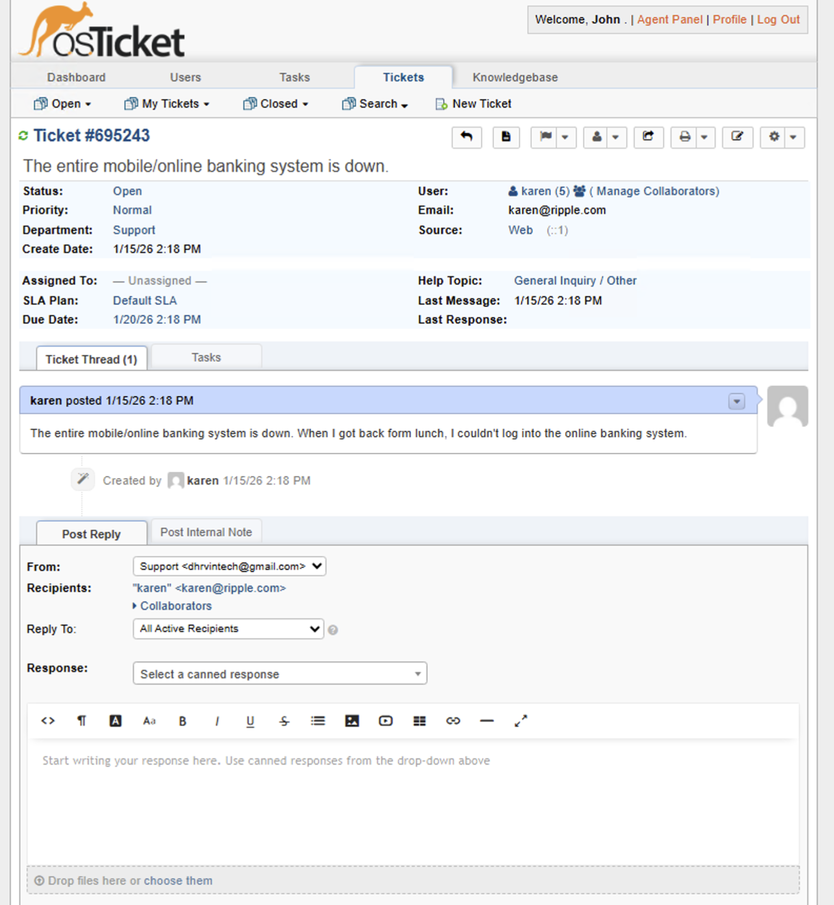
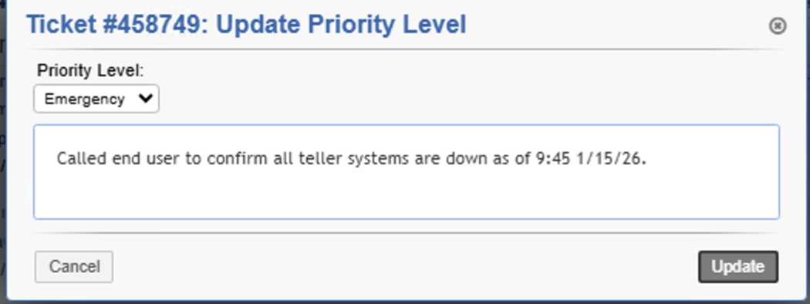
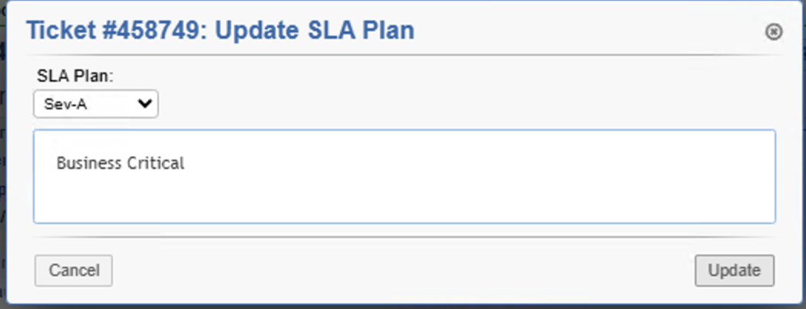
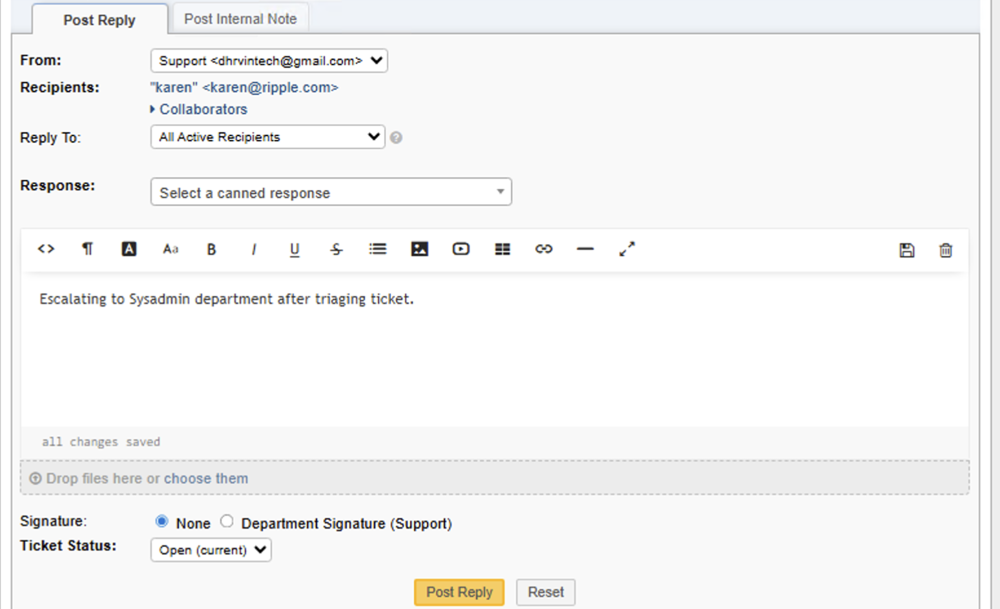
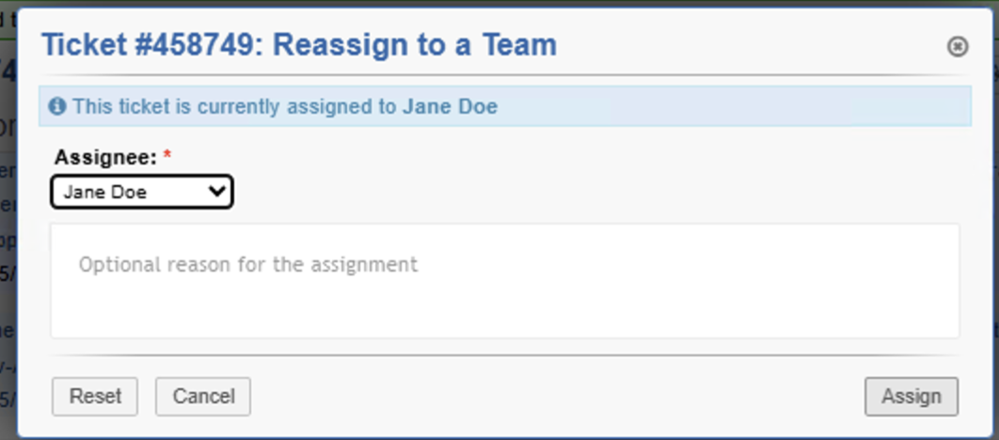
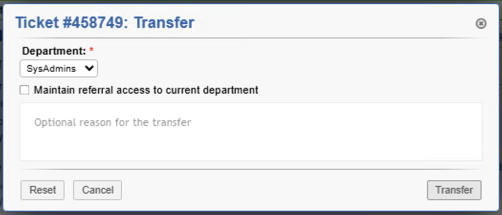
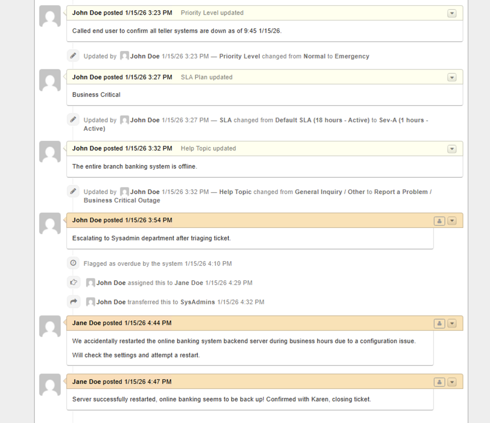
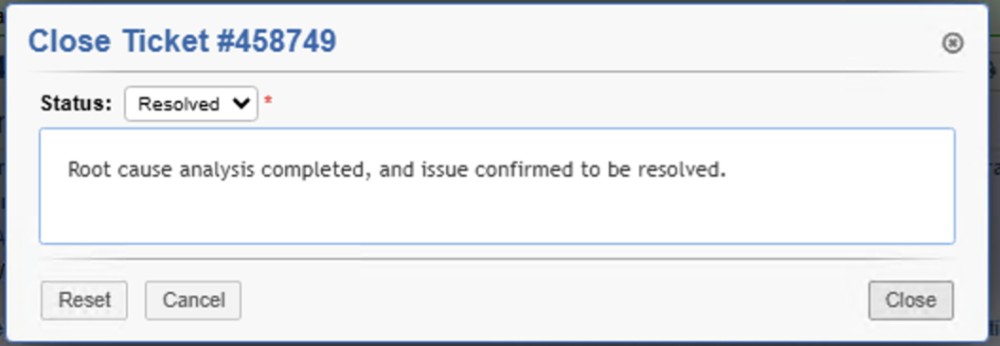

# osTicket Ticket Lifecycle Lab

---

## 📌 Project Overview

This lab documents a complete **ticket lifecycle in osTicket**, from **end-user intake** through **triage, escalation, resolution, and closure**.  

The goal is to demonstrate **professional help desk workflow**, proper documentation practices, SLA handling, and **team-based ticket ownership** in a realistic support environment.

---

## 🛠 Environment & Tools Used

- osTicket  
- Azure Cloud Virtual Machine  
- Windows 10 Pro  
- Microsoft Remote Desktop  

---

## 🎯 Skills Demonstrated

- Ticket intake and documentation  
- Incident triage and prioritization  
- SLA selection and escalation workflow  
- Team reassignment and department handling  
- Ticket correspondence documentation  
- Resolution confirmation and closure  

---

# 🚀 Lab Steps

---

## 1️⃣ Intake: End User Submits Support Ticket

The end user submits a support request through the **customer portal** by entering:

- Contact information  
- Help topic selection  
- Issue description  

Upon submission, a **confirmation message** is generated and a **unique ticket ID** is assigned for tracking.

📸 Screenshots:  

  
*End user accesses the ticket portal to submit a request.*

  
*User fills in contact information, help topic, and describes the issue.*

  
*Ticket confirmation page with unique ticket ID displayed.*

---

## 2️⃣ Agent Access: IT Support Logs In and Opens the Ticket

The IT support agent logs into the **osTicket agent panel** and opens the newly created ticket to begin review and initial triage.

📸 Screenshots:

  
*IT support agent authenticates into the osTicket agent panel.*

  
*The newly created ticket is opened and ready for triage.*

---

## 3️⃣ Triage: Priority, SLA, and Help Topic Updates

The ticket is triaged to determine **business impact and urgency**.

During triage:

- Priority is elevated to **Emergency**
- SLA is updated to **Sev A**
- Help Topic is changed to **Business Critical Outage**

📸 Screenshots:

  
*Ticket priority updated to Emergency based on business impact.*

  
*SLA changed to Sev A to reflect high urgency and response requirements.*

  
*Help topic modified to Business Critical Outage for proper routing and escalation.*

---

## 4️⃣ Escalation: Assign Ticket to SysAdmin

After triage confirms the issue requires advanced support, the ticket is escalated to the **SysAdmin team** for further investigation and remediation.

📸 Screenshots:

  
*Ticket assignment updated to reflect new ownership.*

  
*SysAdmin selected as the responsible team member.*

  
*Department and assignment details confirmed for proper escalation workflow.*

---

## 5️⃣ Ticket Correspondence and History

Throughout the ticket lifecycle, all **correspondence and actions** are documented to ensure:

- End user and IT teams are kept informed  
- Progress, ownership, and resolution details are clear  
- Accountability and continuity are maintained  

📸 Screenshot:

  
*All ticket actions and correspondence logged for clear communication and tracking.*

---

## 6️⃣ Resolution: Restore Service, Confirm Fix, and Close Ticket

The issue is resolved by:

- Restoring service and validating functionality  
- Documenting resolution details  
- Confirming resolution with the end user  
- Marking the ticket as **resolved and closed**  

📸 Screenshots:

  
*Detailed resolution notes documented to capture troubleshooting and fix.*

  
*Ticket marked resolved and closed after end-user confirmation.*

---

# 📊 Lab Outcome

- Full osTicket lifecycle executed successfully  
- Tickets were created, triaged, escalated, and resolved according to IT support workflow  
- Clear documentation and SLA handling demonstrated  
- Hands-on experience with **professional help desk operations** gained  

---

# 📚 Key Takeaways

- Importance of end-to-end ticket lifecycle management  
- Effective triage and escalation workflows  
- SLA application and priority management  
- Maintaining accurate ticket correspondence and documentation  
- Practical help desk skills for IT support roles  

---

# 📌 Future Improvements

- Automate ticket notifications and reminders  
- Implement reporting dashboards for SLA and resolution metrics  
- Expand to multi-level escalations and cross-department workflows  
- Integrate knowledge base articles for faster resolution  

---

# 🏁 Conclusion

This lab demonstrates a **complete ticket lifecycle in osTicket**, reinforcing skills in **ticket intake, triage, escalation, documentation, and closure**.  

It provides hands-on experience essential for **entry-level IT support and service desk professionals**.

---

## 👤 Author

**Gokah William**  
IT & Service Desk Professional  
Focused on Help Desk Operations, Ticket Management, and Entry-Level IT Support
